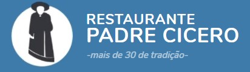
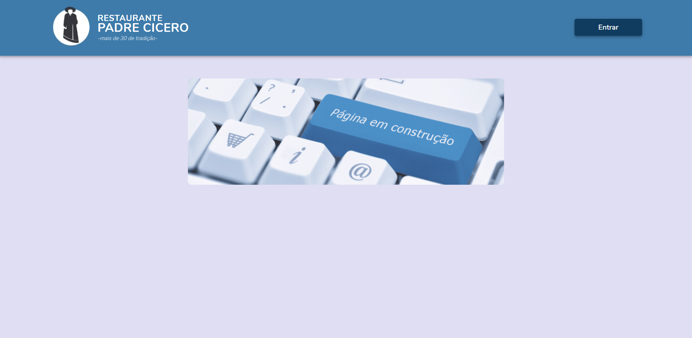
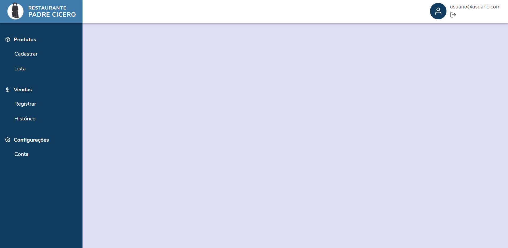
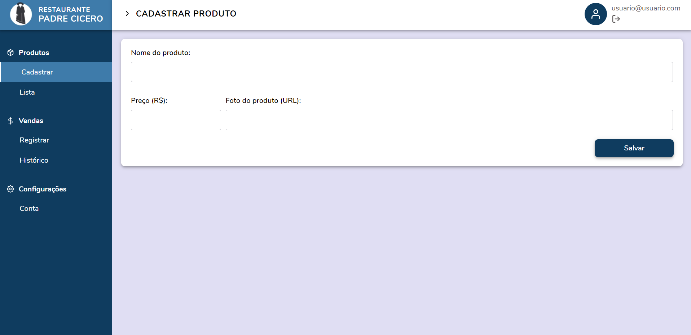
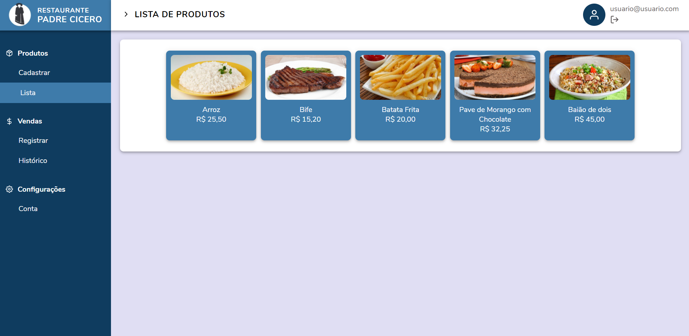
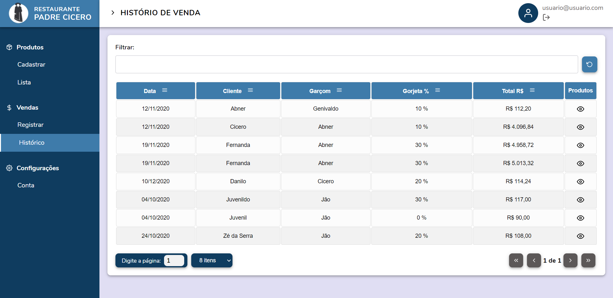
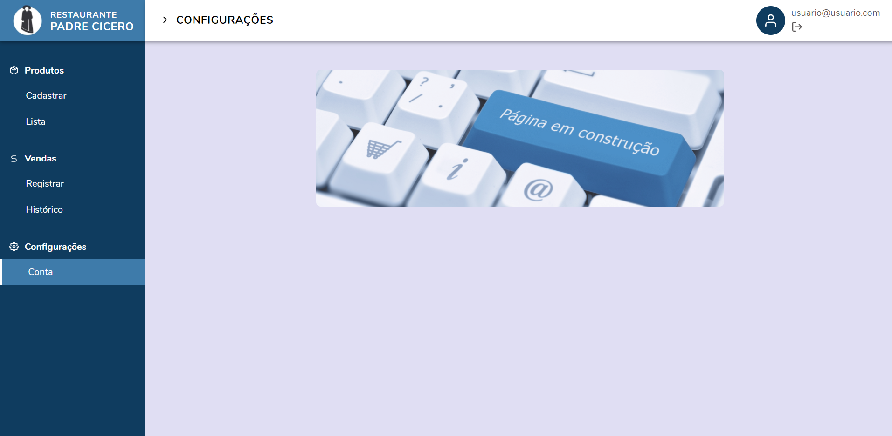

<h1 align="center">
    
</h1>

<p align="center">
  <a href="https://www.linkedin.com/in/abnerwillys/">
    
  </a>

  

  <a href="https://www.javascript.com/">
    
  </a>
  <a href="https://github.com/abner-starkasty/restaurante-padre-cicero/tree/main/backend">
    
  </a>
  <a href="https://github.com/abner-starkasty/restaurante-padre-cicero/tree/main/frontend">
    
  </a>
</p>

---

<p align="center">
 <a href="#-sobre">Sobre</a> •
 <a href="#-etapas-do-projeto">Etapas do projeto</a> • 
 <a href="#-tecnologias-utilizadas">Tecnologias</a> • 
 <a href="#-como-baixar-o-projeto">Como baixar o projeto</a> • 
 <a href="#-licença">Licença</a> • 
 <a href="#-desenvolvedor">Desenvolvedor</a>
</p>

---
### 🔖 Sobre

O **Restaurante Padre Cicero** é um sistema de controle de vendas e produtos.

Um projeto fullstack, desenvolvido em cima de uma API Rest com Node.JS / MongoDb e Front end web com ReactJS.

Este projeto foi realizado como desafio técnico para a empresa **TON Stone**.

---
#### 💻 FrontEnd

<p align="center">
    
    
    
    
    
    
    
</p>

---
### 📝 Etapas do projeto

 - [x] 💯 Construção de Layout;
 - [x] 💯 Construção da API Rest com Node.js / MongoDb;
 - [x] 💯 Implementação da regra de negócio;
 - [x] 💯 Configuração do gerenciamento de estado;
 - [x] 💯 Implementado *paginação, ordenação, filtro* na tabela de histórico de Vendas;
 - [x] 💯 Implementação de um *Spinner* para melhor experiencia do usuário;
 
##### 👉 Novas implementações/features a serem realizadas(sem ordem definida):
 - [ ] 👨‍💻 Implementação de modal mostrando os produtos da venda(Tela Histórico de Vendas);
 - [ ] Implementar SideBar personalizada(que recolhe apenas mostrando ícones);
 - [ ] 👨‍💻 Melhorar responsividade da aplicação;
 - [ ] 👨‍💻 Finalizar CRUD de *produtos*(PUT/DELETE);
 - [ ] 👨‍💻 Finalizar CRUD de *vendas*(PUT/DELETE);
 - [ ] 
 - [ ] 👨‍💻 Implementação de Temas;
 - [ ] 👨‍💻 Implementação de CRUD de *clientes*;
 - [ ] 👨‍💻 Implementação de CRUD de *colaboradores*;
   - [ ] 👨‍💻 Tela de histórico de ganhos com gorjeta do garçom/colaborador;
 - [ ] 👨‍💻 Implementação sistema de login/usuários(já iniciado na API) ;

---
### 🛠 Tecnologias utilizadas


As seguintes tecnologias/ferramentas foram utilizadas:

- [JavaScript](https://www.javascript.com/);
  - [ECS6+](http://www.ecma-international.org/ecma-262/6.0/);
  - [ReactJs](https://reactjs.org/);
    - [Easy-Peasy - State Manager](https://easy-peasy.now.sh/);
    - [React Table](https://react-table.tanstack.com/);
    - [React Icons Fi](https://feathericons.com/);
- [CSS3](https://developer.mozilla.org/en-US/docs/Web/CSS);
  - [Styled-Components](https://styled-components.com/);
- [HTML5](https://developer.mozilla.org/en-US/docs/Web/HTML);
- [Node.js](https://nodejs.org/en/);
    - [Axios](https://www.npmjs.com/package/axios);
    - [Express](https://expressjs.com/);
- [MongoDB](https://www.mongodb.com/);
    - [Mongoose](https://mongoosejs.com/);
- [Insomnia](https://insomnia.rest/);
- [Git](https://git-scm.com/);
- [VSCode](https://code.visualstudio.com/);


---
### 📎 Como baixar o projeto

##### 👉 Ferramentas necessárias:
- Editor:
    - [Vscode](https://code.visualstudio.com/) foi utilizado nesse projeto; 
- [Node.Js](https://nodejs.org/en/) - Instalado em sua máquina;
- [Git](https://git-scm.com/downloads) - Instalado em sua máquina;

##### 👉 Instalar dependências:

```bash

#->No terminal:

# Clonar repositório:
$ git clone https://github.com/abner-starkasty/restaurante-padre-cicero

# Entrar no diretório desejado:
-> $ cd frontend
-> $ cd backend

# Instalar dependências
$ yarn install

# Iniciar o projeto
$ yarn start    # No Frontend
$ yarn dev      # No Backend

# Após carregar o projeto automaticamente irá abrir uma guia no navegador padrão.

```


---
### 📜 Licença

Esse projeto está sob a licença MIT. Veja o arquivo [LICENSE](LICENSE) para mais detalhes.

---

### 👨‍💻 Desenvolvedor

<p align="center">
    <a href="https://blog.rocketseat.com.br/author/thiago/">
        
        <br/>
        <sub><b>Abner Willys  🚀</b></sub>
    </a>
</p>
</br>
<h6 align="center">
    Feito com 💜 por Abner Willys 🙌 Entre em contato 😊🤓
</h6>

<p align="center">
    <a href="https://www.linkedin.com/in/abnerwillys/">
        
    </a>
    <a href="https://twitter.com/AbnerStarkasty">
        
    </a>
    <a href="mailto:tgmarinho@gmail.com">
        
    </a>
    <a href="https://www.facebook.com/abnerwillys">
        
    </a>
    <a href="https://bit.ly/3eC6MX5">
        
    </a>
</p>
